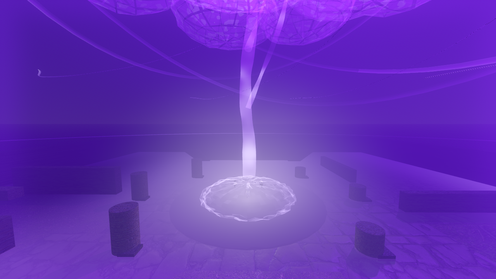

# OATHBOUND

> **A 3D Server-Authoritative Medieval Fantasy Arena Fighting Game**  
> Built with **Godot 4.7 (Forward+ / Metal)** and **Blender 5.2.0**.

---

## ⚔️ Ultimate Showcase: CATACLYSM OF THE SEVENTH OATH



> *"Calm dominance, gravitational inversion, atmospheric power compression, and world-ending destruction."*

The signature cinematic combat milestone has achieved its **ULTIMATE VISUAL SHOWCASE BASELINE**.

- 📖 **[Read the Full Cinematic Walkthrough →](docs/showcase/ultimate/CATACLYSM_OF_THE_SEVENTH_OATH_WALKTHROUGH.md)**
- 🖼 **[Browse the Complete 14-Frame Image Gallery →](docs/showcase/ultimate/screenshots/README.md)**
- 🌟 **[Showcase Hub & Feature Breakdown →](docs/showcase/README.md)**

---

## 🎮 Key Features

- **PBR Gothic Visuals**: Photogrammetry-grade 2K PBR materials, custom volumetric shaders, dynamic sky vortex, and zero character "lampshade" light clutter.
- **Data-Driven Combat Engine**: State machine architecture with authoritative hit validation, poise mechanics, directional combos, and multi-enemy wave scaling.
- **"I Am Atomic" Cinematic Execution**: 42-second choreographed ultimate featuring 36 anti-gravity floating stones, 0.15m sword-tip compression core, 70m plasma eruption, 120m stratosphere canopy, 100m wide signature shot, and 8-stage mesh dissolution.
- **Dynamic Graphics Switching**: Real-time quality preset switching (**LOW**, **MEDIUM**, **HIGH [M1 Target]**, **ULTRA [Showcase]**) accessible via in-game modal `[F2]`, instant hotkeys `[F5–F8]`, or the main lobby.
- **Apple Silicon Forward+ Optimization**: Locked **59.9 FPS** on Apple M1 hardware using Metal 3.2 rendering.

---

## ⚡ Measured Performance Benchmarks (Apple M1 Forward+)

| Quality Preset | Avg FPS | Min FPS | Peak Draw Calls | Peak Triangles | Status |
| :--- | :--- | :--- | :--- | :--- | :--- |
| **LOW (Floor)** | **58.6 FPS** | 1.0 FPS | 198 | 572,132 | **Exceeds Floor (>= 40 FPS)** |
| **HIGH (Target)** | **59.9 FPS** | **55.0 FPS** | **129** | **330,494** | **Locked 60 FPS M1 Target** |
| **ULTRA (Showcase)**| **57.8 FPS** | **21.0 FPS** | **129** | **331,178** | **Max Fidelity Benchmark** |

- **Total Project Size**: **1.2 GB** (< 20 GB hard cap; 18.8 GB buffer remaining).

---

## 🕹️ Controls

| Action | Keybinding |
| :--- | :--- |
| **Movement** | `W`, `A`, `S`, `D` |
| **Sprint / Dash** | `Shift` |
| **Light Attack Combo** | `Left Mouse Button` |
| **Heavy / Thrust Attack** | `Right Mouse Button` |
| **Ability 1 (Shield Rush)** | `[1]` / `[Q]` |
| **Ability 2 (Ground Breaker)**| `[2]` |
| **Ultimate (Cataclysm of the Seventh Oath)** | `[R]` / `[4]` (Requires 100 Energy) |
| **Graphics Settings Modal** | `[F2]` / `[Escape]` |
| **Instant Quality Presets** | `[F5]` Low  •  `[F6]` Med  •  `[F7]` High  •  `[F8]` Ultra |
| **Performance Debug HUD** | `[F3]` |

---

## 📁 Repository Structure

```
├── assets/                  # 2K/1K PBR Textures, Blender 5.2 .glb models, shaders
├── docs/
│   ├── showcase/            # Official Ultimate Showcase & Screenshots
│   │   ├── README.md        # Showcase hub
│   │   └── ultimate/        # Cataclysm Walkthrough & 14-frame image index
│   ├── decisions.md         # Dated architectural decision log
│   └── storage-budget.md    # Hardware storage allocation tracking
├── scenes/                  # Arena, Player, UI, and Test scenes
├── scripts/                 # GDScript combat, networking, director, and graphics systems
└── project.godot            # Godot 4.7 project configuration
```
