# CATACLYSM OF THE SEVENTH OATH — Screenshot Index

*Captured in ULTRA Graphics Preset (MSAA 4X, 4K Shadows, Forward+ Metal) on Apple M1.*

---

| # | Frame | Title | Cinematic Phase | Description |
| :---: | :---: | :--- | :--- | :--- |
| **01** | 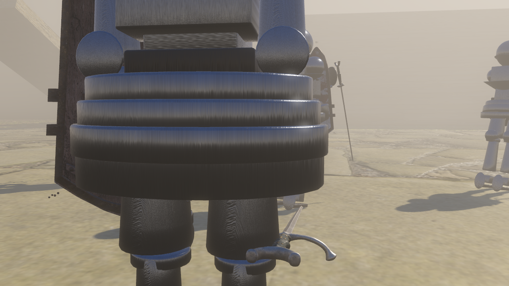 | `01_ultimate_preparation.png` | **Preparation** | Knight standing calmly with sword lowered before supernatural activation. |
| **02** | 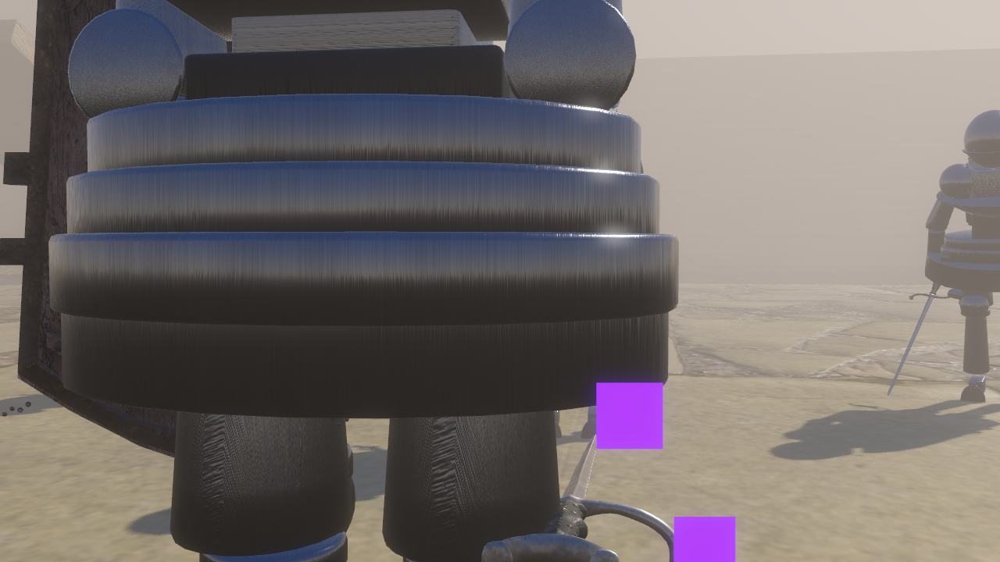 | `02_power_awakening.png` | **Awakening** | First visible supernatural buildup; sparks leak along armor seams. |
| **03** | 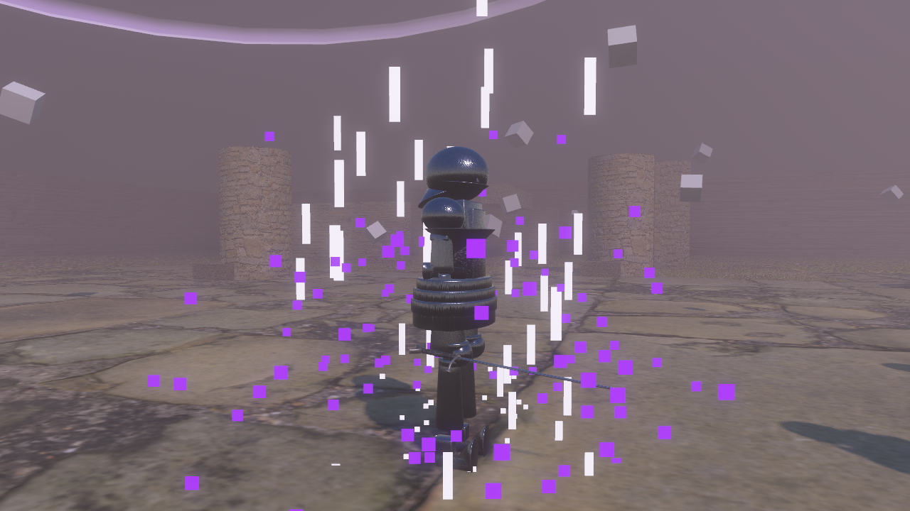 | `03_battlefield_dominion.png` | **Dominion** | Gravitational inversion: 36 arena paver stones levitate 5–30m in anti-gravity tension. |
| **04** | 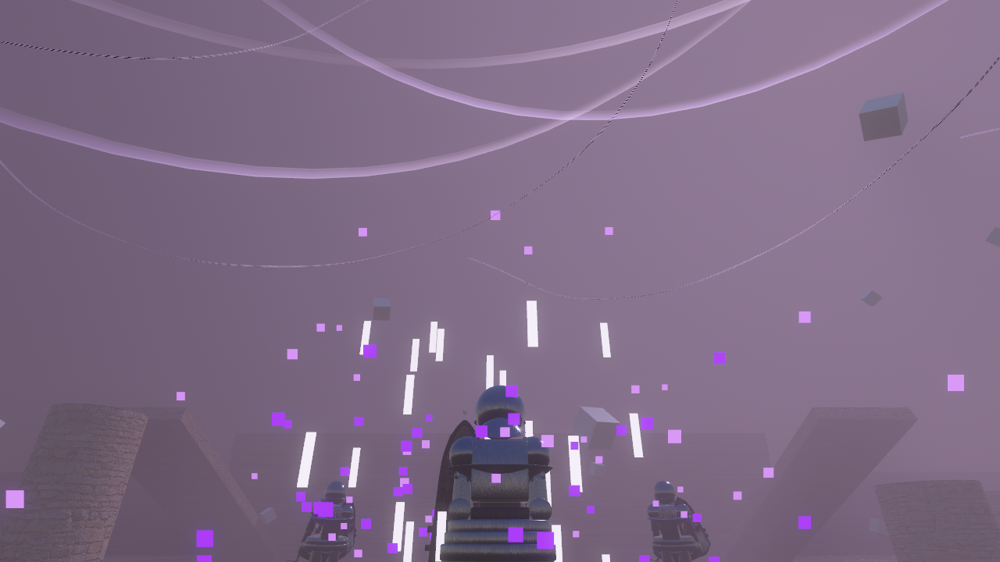 | `04_sky_transformation.png` | **Sky Vortex** | Daylight dims to 0.02 energy as upper celestial vortex accelerates and gathers plasma. |
| **05** | 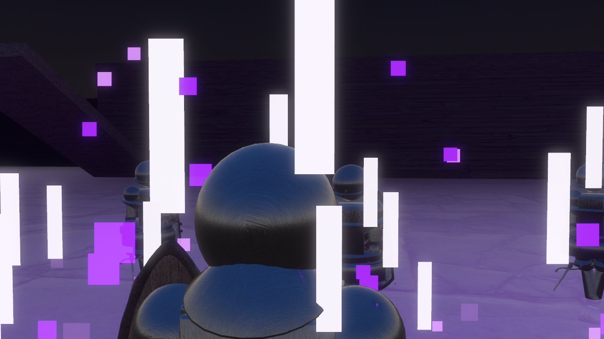 | `05_power_compression.png` | **Compression** | Extreme inward implosion: debris and lightning collapse into a tiny 0.15m core at sword tip. |
| **06** |  | `06_release_flash.png` | **Release Flash** | 0.08s blinding HDR flash pulse illuminating Knight silhouette against the arena. |
| **07** | 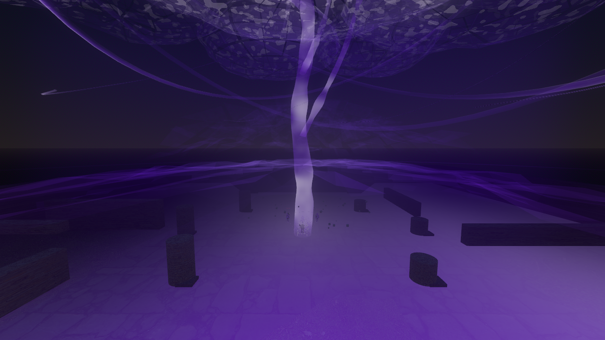 | `07_world_ending_detonation.png` | **Detonation** | **Signature Shot**: 100m wide vantage capturing ground crater, radial shockwave, vertical branch, and canopy. |
| **08** | 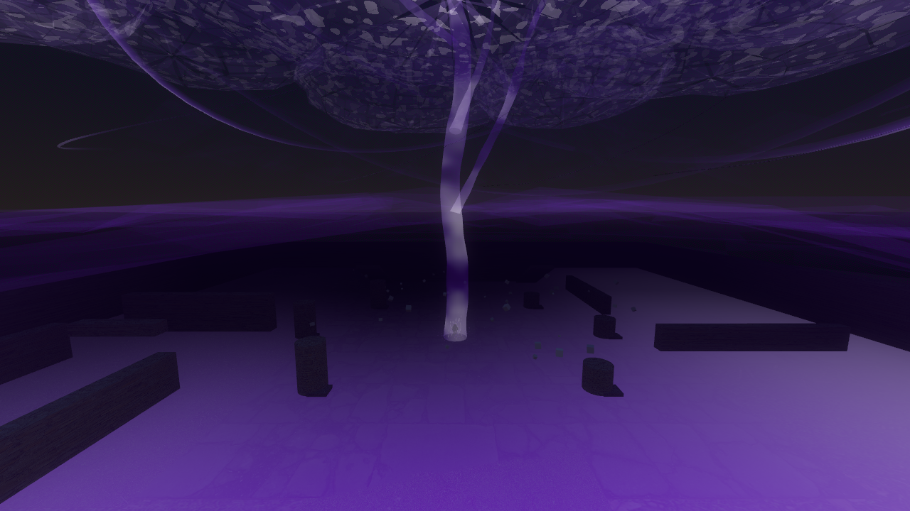 | `08_sky_cataclysm.png` | **Sky Canopy** | 120m irregular billowing cloud canopy tearing through the stratosphere with internal lightning. |
| **09** | 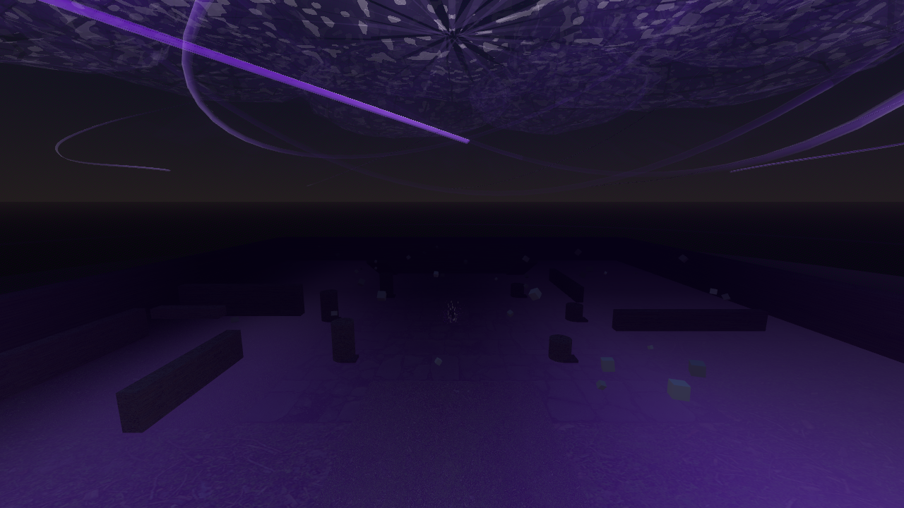 | `09_enemy_impact.png` | **Impact** | Expanding 38 m/s spatial shockwave hits enemies, causing dramatic physical recoil. |
| **10** | 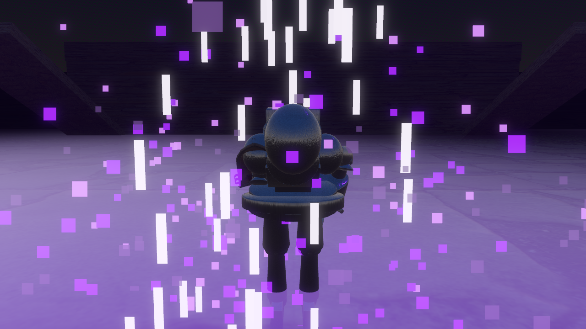 | `10_enemy_vaporization.png` | **Vaporization** | Preserved 8-stage dissolution shader disintegrates enemy geometry into glowing ash. |
| **11** | 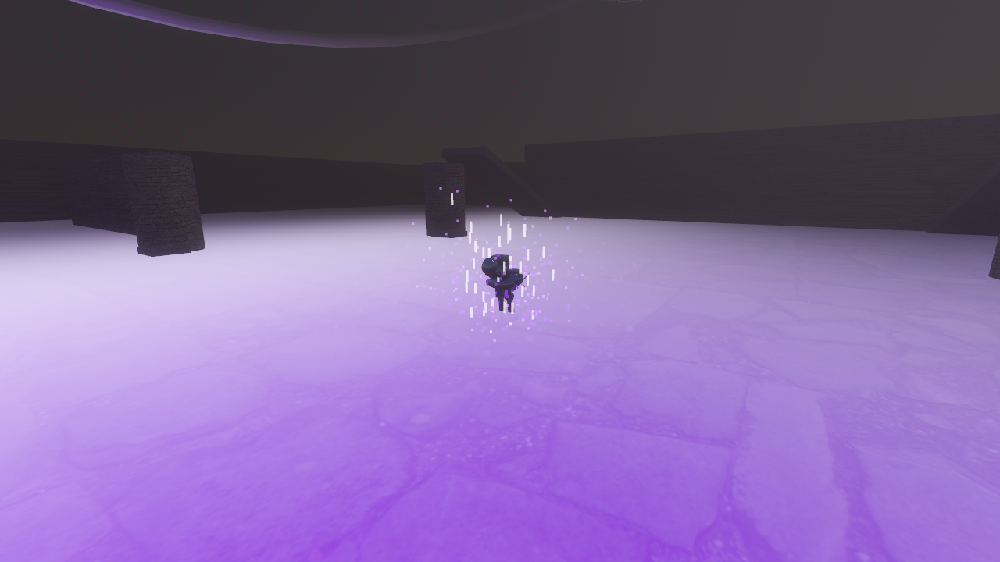 | `11_aftershock.png` | **Aftershock** | Secondary shockwaves pulse across the scarred ground under the slowly rotating sky wound. |
| **12** | 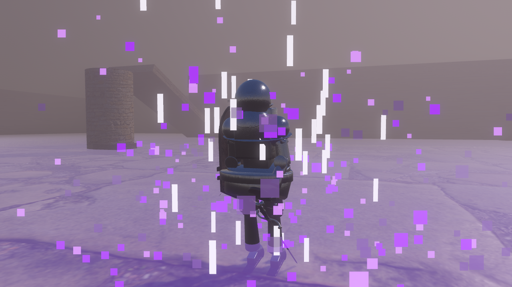 | `12_victory_pose.png` | **Victory** | Knight lowers sword in quiet atmosphere, lit solely by clean metallic rim lighting. |
| **13** | 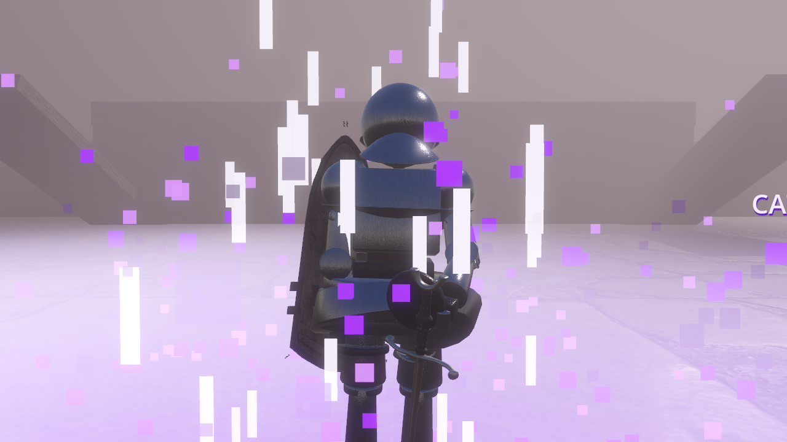 | `13_ultimate_title.png` | **Mythic Title** | Golden sequential title banner: "CATACLYSM OF THE SEVENTH OATH". |
| **14** | 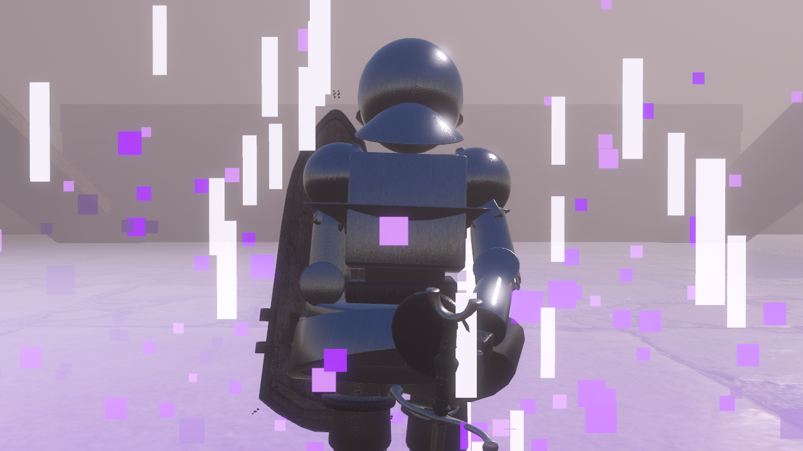 | `14_player_wins.png` | **Triumph** | Match victory banner: "PLAYER WINS", smoothly returning gameplay controls. |

---

📁 *Parent Documentation: [Cataclysm Walkthrough](../CATACLYSM_OF_THE_SEVENTH_OATH_WALKTHROUGH.md) | [Showcase Hub](../../README.md)*
